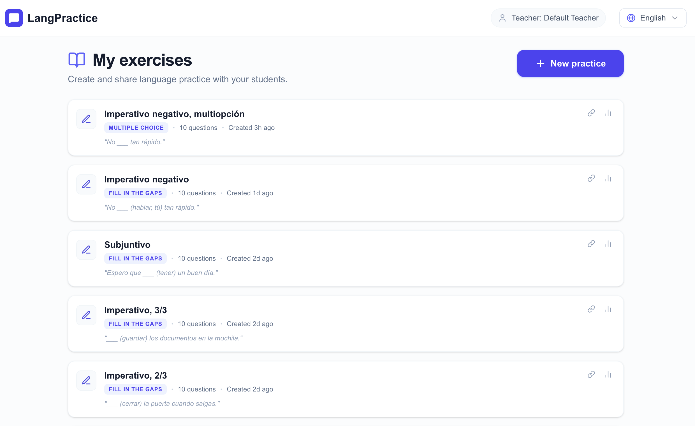
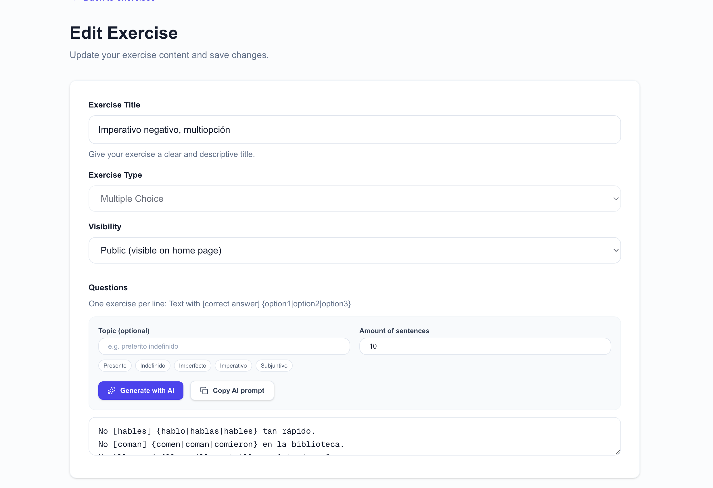
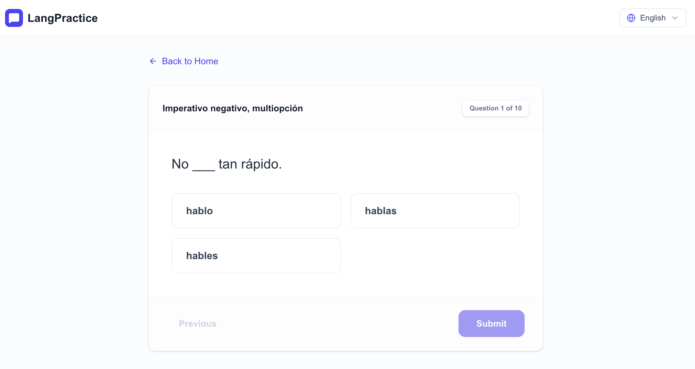

# Language Practice Web

A web application for creating and completing interactive Spanish language exercises.

Teachers can create exercises manually or generate them with AI, while students can practice through simple shareable links without registration.

---

## 💡 Why I Built This

I built this project while learning Spanish in Argentina.

Most existing language practice websites either:
- don't support Argentine Spanish well,
- are uncomfortable for quick custom grammar practice,
- or rely on AI chat interfaces that are not ideal for repetitive tense exercises.

I wanted a faster way to generate and practice focused grammar exercises, especially for Spanish verb tenses used in everyday Argentine Spanish.

---

## 🌟 Features

- Teacher dashboard for creating and managing exercises
- AI-powered Spanish exercise generation
- Multiple exercise formats
- Instant feedback for students
- Mobile-friendly responsive UI
- Multilingual support (English, Spanish)

---

## 📸 Screenshots

### Teacher Dashboard


### Teacher Dashboard


### Student Practice


---

## 🚀 Tech Stack

- Next.js 15
- TypeScript
- Tailwind CSS
- next-intl

---

## ⚙️ Getting Started

### Installation

```bash
cd web
npm install
```

### Configuration

Create `.env.local`:

```properties
NEXT_PUBLIC_API_URL=http://localhost:8080
```

### Run

```bash
npm run dev
```

Open http://localhost:3000

---

## 🏗 Architecture Notes

- App Router architecture
- Shared typed API client
- Dynamic routes for teacher/student flows
- Internationalized routing with next-intl
- Responsive Tailwind UI

---

## 📂 Related Repositories

- [API Backend](https://github.com/ValentinaBaranova/lang-practice-api)
